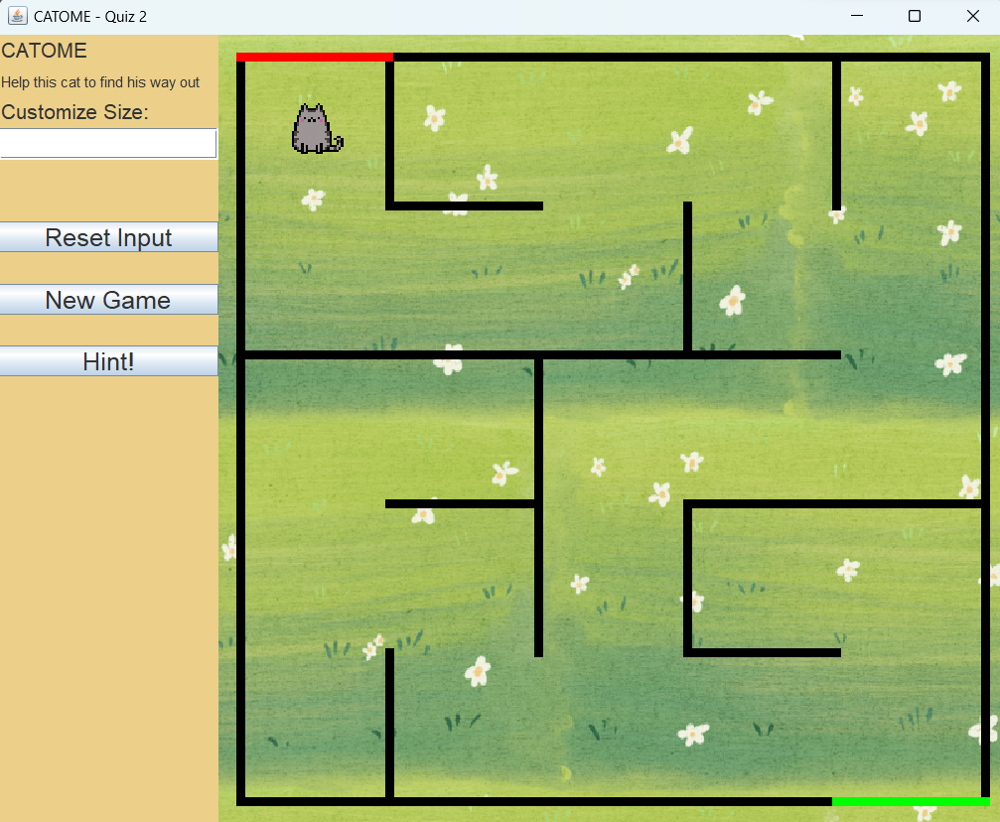

# DAA_QUIZ_2
---
## Team Member
1. Abdullah Nasih Jasir        (5025211111)
2. Al-Ferro Yudisthira Putra   (5025211176)
3. Muhamad Faiz Fernanda       (5025211186)

---
## Definition Game
CATOME, short for Cat - Home, is a maze game that challenges players to navigate through a complex labyrinth to reach a goal. The game allows players to customize the size of the map, with larger maps offering increased difficulty. The objective is to move the ball up, down, left, or right to guide it to the finish line. Maze games are enjoyable for people of all ages and skill levels. They provide a stimulating way to enhance problem-solving and spatial reasoning abilities. Additionally, maze games often incorporate strategic thinking, timing, and coordination, offering players a challenging and fulfilling gaming experience.

---
## Interface
Here is the interface of the CATOME game that we have created:

In the initial stage, there is a small cat, and our goal is to navigate it through a maze and reach the finish line. We can control the cat's movement by pressing different buttons: up, left, right, and down. When we successfully guide the cat to the finish line, a message "You Win! Would you like to play again?" will be displayed, indicating that we have completed the maze. If the player chooses to play again by selecting "Yes," the game will restart with a new maze. However, if the player chooses "No," the game will stop as it is.

---
## Algorithm
In this game, the Maze.java file utilizes the Depth First Search (DFS) algorithm. DFS is a graph traversal algorithm that explores as far as possible along each branch before backtracking. It starts at a specific node (or the root node) and explores as deeply as possible before backtracking to explore other branches. The DFS algorithm can be implemented recursively or using a stack data structure. In the recursive approach, it visits a node, then recursively visits each of its children until there are no more unvisited nodes. When using a stack, it visits a node, pushes its unvisited children onto the stack, and continues visiting nodes from the stack. DFS is commonly used for various graph-related problems such as finding connected components, detecting cycles, and generating mazes. It is a straightforward algorithm to grasp and implement.
